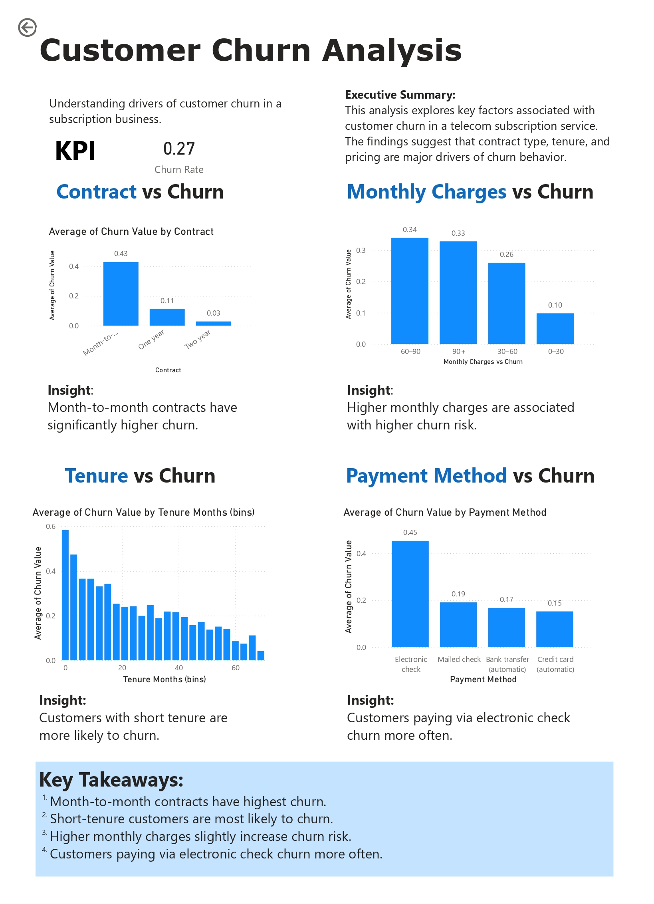

# 📊 IBM Telco Customer Churn Analysis

This project analyzes customer churn behavior in a telecom subscription dataset.  
The goal is to identify key factors influencing churn and provide actionable business insights.

---

## 📁 Project Structure

- `Telco_customer_churn.xlsx` — Raw dataset
- `telco_clean.csv` — Cleaned dataset used for analysis
- `telco churn.ipynb` — Jupyter Notebook containing data analysis & visualizations
- `dashboard.pbix` — Power BI dashboard file
- `dashboard.pdf` — Exported dashboard report

---

## 🎯 Objective

The main objective of this analysis is to understand **why customers leave the service (churn)** and identify the most influential factors such as:

- Contract type
- Customer tenure
- Monthly charges
- Payment method

---

## 📊 Dashboard Preview

### Overview Dashboard

---

## 📌 Executive Summary

This analysis explores key factors associated with customer churn in a telecom subscription service.

The findings suggest that **contract type, tenure, and pricing** are major drivers of churn behavior.

---

## 📊 Key Analysis & Insights

### 1. Churn Rate by Contract Type
**Insight:**  
Month-to-month contracts have significantly higher churn compared to long-term contracts.

---

### 2. Tenure vs Churn
**Insight:**  
Customers with short tenure are more likely to churn.

---

### 3. Monthly Charges vs Churn
**Insight:**  
Higher monthly charges are associated with higher churn risk.

---

### 4. Payment Method vs Churn
**Insight:**  
Customers paying via electronic check churn more often than other payment methods.

---

## 🔑 Key Takeaways

- Month-to-month contracts show the highest churn rate  
- Short-tenure customers are the most likely to churn  
- Higher monthly charges slightly increase churn risk  
- Electronic check users have higher churn tendency  

---

## 📈 Tools & Technologies

- Python (Pandas, NumPy, Matplotlib, Seaborn)
- Jupyter Notebook
- Power BI
- Excel

---

## 📌 Business Impact

These insights can help telecom companies:

- Improve customer retention strategies
- Encourage long-term contracts
- Adjust pricing strategies
- Target high-risk customer segments

---

## 🚀 Future Improvements

- Build a predictive churn model (Machine Learning)
- Deploy an interactive dashboard
- Perform customer segmentation analysis

---

## 👤 Author

IBM Telco Churn Analysis Project  
